### 为什么使用rebase
- rebase最大的好处是你的项目历史会非常整洁 
- rebase 导致最后的项目历史呈现出完美的线性——你可以从项目终点到起点浏览而不需要任何的 fork。这让你更容易使用 git log、git bisect 和 gitk 来查看项目历史。

 
### rebase 和 merge的区别
   - 假设现在的工作流
   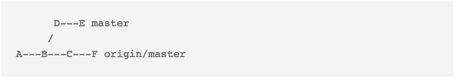 
   - 项目从B开始出现分支，同事开发了C，F功能并于你之前提交到了远程的master分支，你本地开发了D，E功能，并打算提交到远程分支。
   - 如果使用merge合并分支 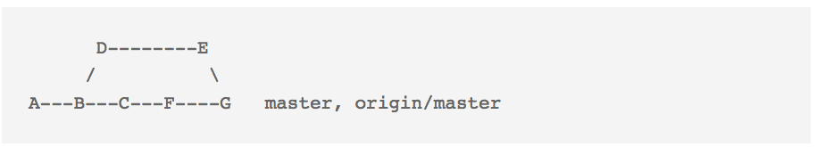 
     如图所示，会多出来G节点，该节点的信息往往是 Merge ...into ...,
     没有任何有效信息。
    - 如果使用rebase合并分支，
      就会出现“完美”的线性工作流，D、E分支被加到了F分支后面，而且不会出现多余的合并分支的信息，看起来非常简洁。

### 如何使用rebase  
 - 如图，我在本地commit了三次 ,先于远程分支三个版本。
    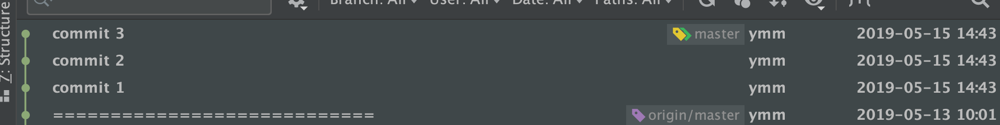
    此时我想把本地代码push到远程分支上去。
    点击（对应命令 git pull --rebase）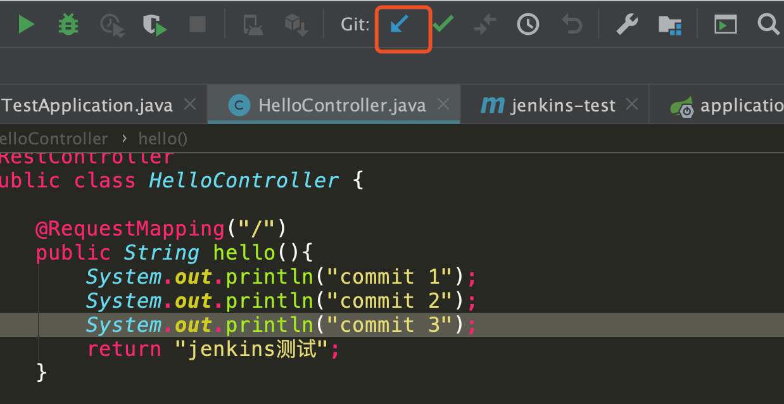
    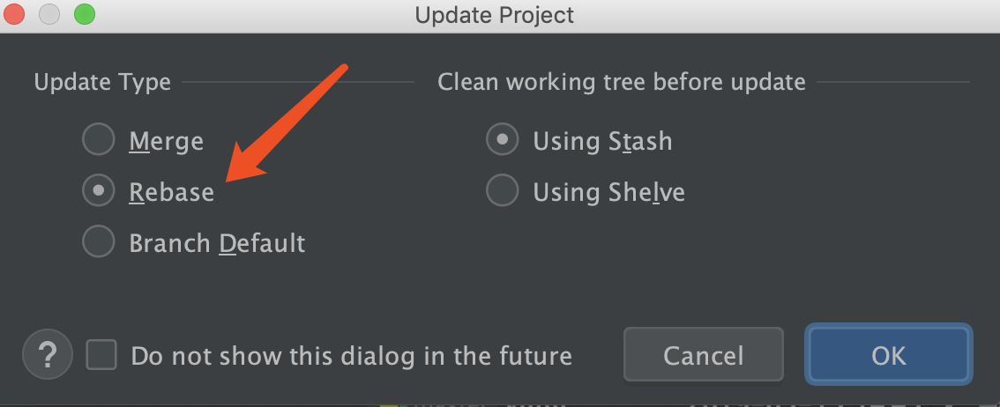
    发现有冲突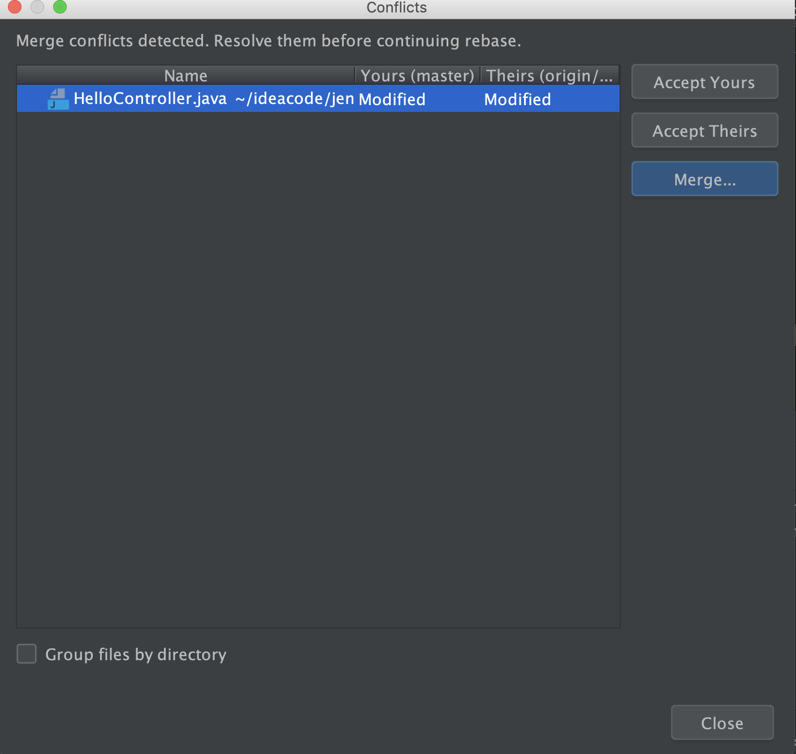
    这里我在pull之前commit了3次，所以要解决三次冲突。合并完之后
    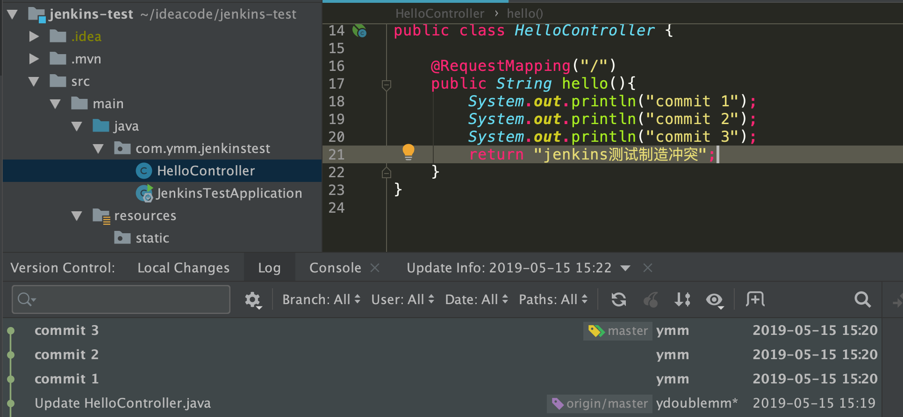
    git的工作流是一条完美的直线。
    合并之后发现多次commit提交了没用的信息，想要删除commit 3，和修改commit 2
    （对应命令 git rebase -i HEAD~3)
    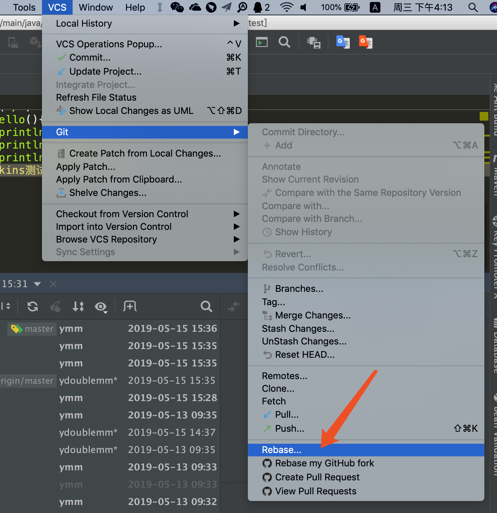
    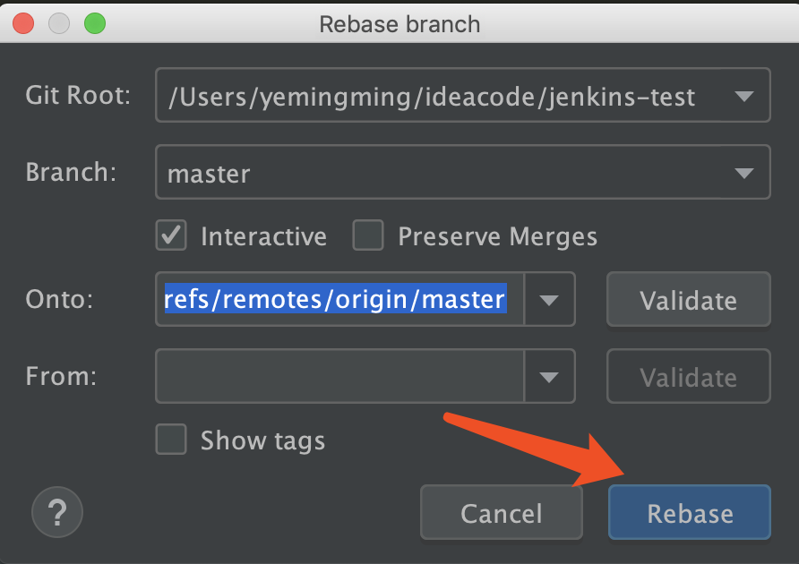
    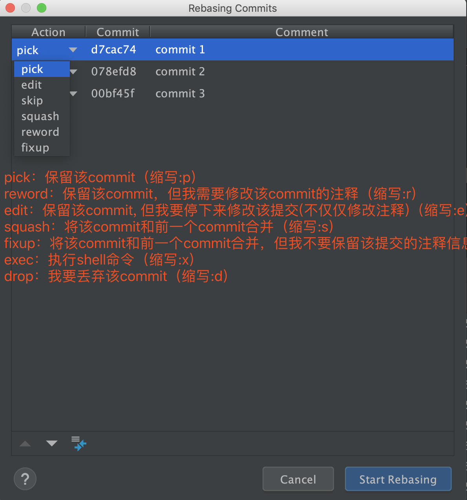
    完成后
    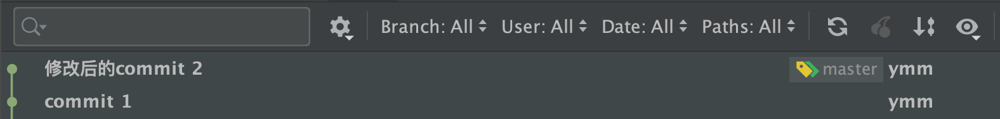
    以上就是rebase的基本用法

    ### 注意：
    - 绝不要在公共的分支上使用rebase！一般在本地分支上使用。
    -  因为工作流变成了直线，无法在工作流中体现功能的并行开发。

    

